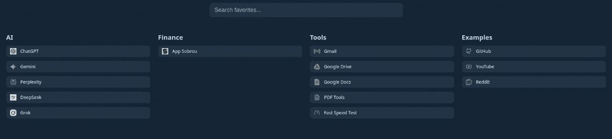
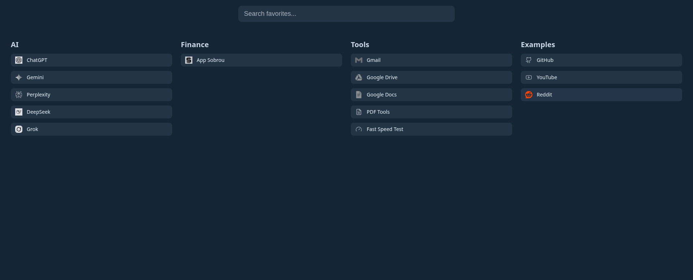

# Dashkey

**Dashkey** is a minimal, fast and self-hosted dashboard designed for quick access to your favorite services.

Built with **pure PHP**, Dashkey focuses on simplicity, performance and automatic icon caching to keep your dashboard clean and responsive.

---

## Demo



## Screenshot



---

## Features

* ⚡ **Lightweight** — pure PHP, no database required
* 🖼 **Automatic icon fetching and caching**
* 🌍 **Multi-language support** (English / Portuguese)
* 🎨 **Multiple built-in themes**
* 🔎 **Fast service search**
* 🧩 **Simple configuration files**
* 🚀 **Works on any PHP server (Nginx / Apache)**

---

## Requirements

* PHP **8.0+**
* Composer
* Web server (Nginx or Apache)

---

## Installation

### 1. Clone the repository

```
git clone https://github.com/RafaelMeirim/dashkey.git
cd dashkey
```

### 2. Install dependencies

```
composer install
```

## Permissions (Important)

If icons are not being cached or the cache folder is not created, make sure PHP can write to the project directory.

Run:

```
sudo chown -R www-data:www-data /var/www/dashkey
```

This allows the web server to create and store cached icons.

---

## How to Use

Dashkey is configured through two main files:

config/settings.php
config/services.yaml

## 1️⃣ Add Your Sites

All dashboard sites are defined in:

**config/services.yaml**

You can edit this file to:

add new services
organize services by category
customize icons
define search shortcuts

After editing the file, simply refresh the page and Dashkey will update automatically.

## 2️⃣ Dashboard Settings

Global dashboard settings are configured in:
**config/settings.php**

## 3️⃣ Themes

Dashkey includes several built-in themes:

Default
Dracula
GitHub Dark
Light
Midnight
Nord
Ocean
Solarized

To change the theme, edit:
textconfig/settings.php

## Project Structure

```
dashkey
│
├── config
│   ├── locales
│   ├── themes
│   ├── services.yaml
│   └── settings.php
│
├── public
│   ├── assets
│   ├── icons
│   └── index.php
│
├── src
│   ├── CacheManager.php
│   ├── IconRenderer.php
│   └── Translator.php
│
└── composer.json
```

---

## Contributing

Contributions are welcome.

If you'd like to improve Dashkey:

1. Fork the repository
2. Create a new branch
3. Submit a Pull Request

---

## License

This project is released under the **MIT License**.

---

## Author

Created by **Rafael Meirim**.